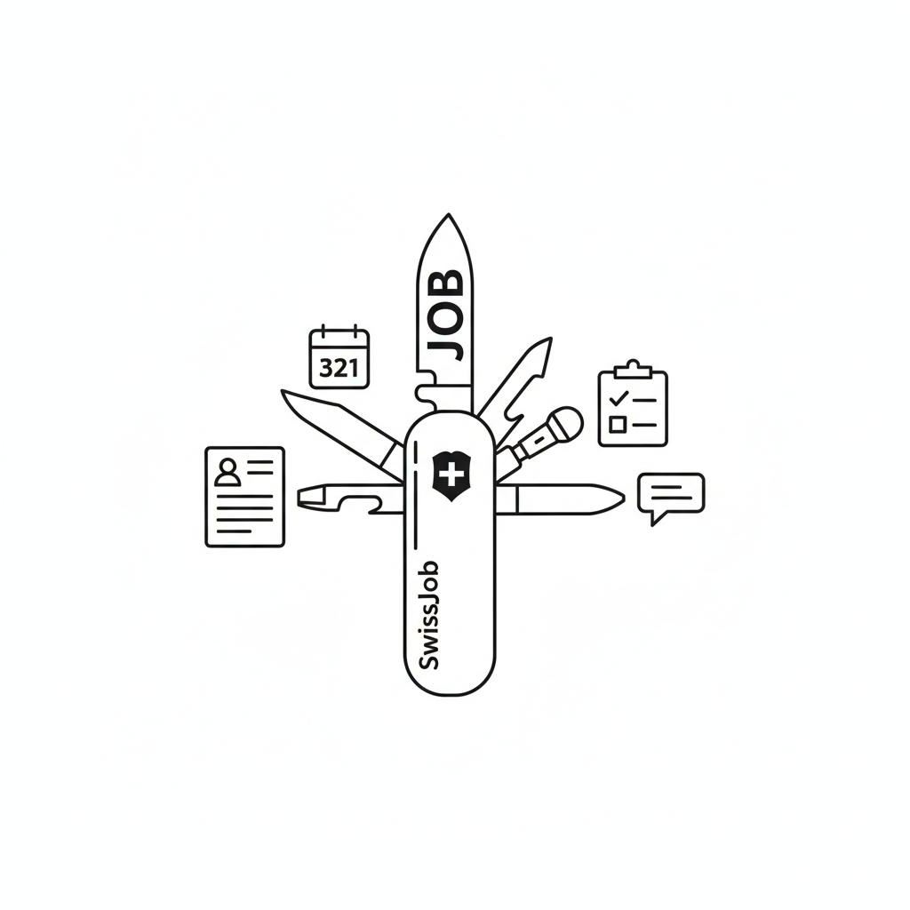

<div align="center">

# SwissJob



**你的求职瑞士军刀**

[English](README.md) | [简体中文](README.zh-CN.md)

[](https://opensource.org/licenses/MIT)
[](https://nextjs.org/)

---

一个开源的、AI 驱动的求职管理平台 - 你找工作唯一需要的工具。就像瑞士军刀一样，它将求职过程中需要的所有功能整合到一个强大的工具中。

</div>

## ✨ 核心功能

- **🤖 AI 智能解析职位描述**：粘贴任何 JD，AI 自动提取公司名称、职位和所需技能
- **💬 对话式交互界面**：与 AI 自然对话，添加和完善职位信息
- **📊 流程管理**：通过 待处理 → 进行中 → 已完成 三个阶段追踪申请进度
- **🎙️ 面试录音与转写**：录制面试并获得 AI 驱动的转写（Whisper）
- **📄 简历分析**：上传简历，获得 AI 驱动的技能匹配分析
- **🎯 模拟面试生成器**：基于 JD 和你的简历生成定制化面试问题
- **📈 技能树可视化**：可视化你的技能并追踪成长轨迹
- **📅 日历集成**：将面试日程导出到你的日历

## 🚀 快速开始

### 一键安装

```bash
git clone https://github.com/ZHHHH9980/SwissJob.git
cd SwissJob
./setup.sh
```

就这么简单！脚本会自动：
- ✅ 安装所有依赖
- ✅ 初始化数据库
- ✅ 创建配置文件

然后启动应用：
```bash
npm run dev
```

访问 http://localhost:3000 开始使用 SwissJob！

### 前置要求

- **Node.js** 18+ 和 npm

### Whisper 转写功能（可选）

SwissJob 支持三种面试转写模式：

1. **None**（默认）：禁用转写功能
2. **OpenAI API**：使用 OpenAI 的 Whisper API（需要 API 密钥）
3. **Local**：本地运行 Whisper（免费，但需要 Python 环境）

要启用转写功能，编辑你的 `.env` 文件：

```bash
# OpenAI API 模式
WHISPER_MODE=api
OPENAI_API_KEY=your_key_here

# 本地模式
WHISPER_MODE=local
WHISPER_API_URL=http://localhost:9000
```

本地模式设置请参考 [scripts/README.md](scripts/README.md)。

### 手动安装

<details>
<summary>点击展开手动安装步骤</summary>

1. **克隆仓库**
   ```bash
   git clone https://github.com/ZHHHH9980/SwissJob.git
   cd SwissJob
   ```

2. **安装依赖**
   ```bash
   npm install
   ```

3. **配置环境变量**
   ```bash
   cp .env.example .env
   # 编辑 .env 并添加你的 API 密钥（OpenAI、Anthropic 等）
   ```

4. **初始化数据库**
   ```bash
   cd frontend
   npx prisma generate
   npx prisma db push
   cd ..
   ```

5. **启动应用**
   ```bash
   npm run dev
   ```

   访问 http://localhost:3000

</details>

## 📖 使用指南

### 添加职位

1. 在仪表板点击 **"+ Add Position"**
2. 粘贴完整的职位描述
3. AI 将提取公司、职位和技能信息
4. 通过对话审核并确认或调整信息
5. 点击 **"确认并保存"**

### 管理你的求职流程

- **待处理（Pending）**：新添加的、正在考虑的职位
- **进行中（In Progress）**：活跃的申请和已安排的面试
- **已完成（Completed）**：已结束的面试（录用、拒绝或撤回）

### 录制面试

1. 进入公司详情页
2. 点击 **"Schedule Interview"**
3. 面试后上传录音文件
4. 获得 AI 驱动的转写和分析

## 🛠️ 技术栈

### 前端
- **Next.js 14** - 带 App Router 的 React 框架
- **TypeScript** - 类型安全开发
- **Tailwind CSS** - 实用优先的样式框架
- **Prisma** - 类型安全的数据库 ORM
- **SQLite** - 轻量级数据库

### AI 集成
- **OpenAI API** - GPT-4 用于分析，Whisper 用于转写
- **Anthropic API** - Claude 用于对话
- 用户提供自己的 API 密钥（隐私优先）

## 🤝 贡献

欢迎贡献！无论是：

- 🐛 Bug 报告
- 💡 功能建议
- 📝 文档改进
- 🔧 代码贡献

请随时提交 issue 或 pull request。

## 📝 开源协议

本项目采用 MIT 协议 - 详见 [LICENSE](LICENSE) 文件。

---

<div align="center">
为全球求职者用心打造 ❤️
</div>
